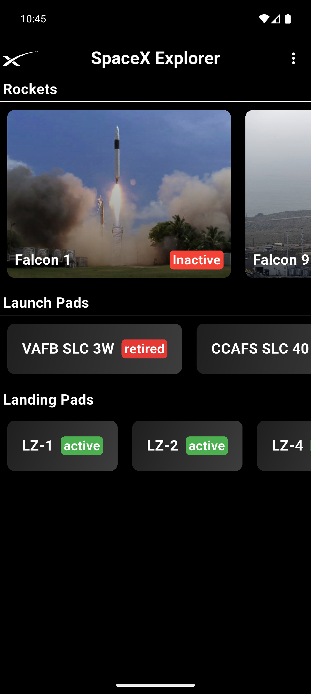
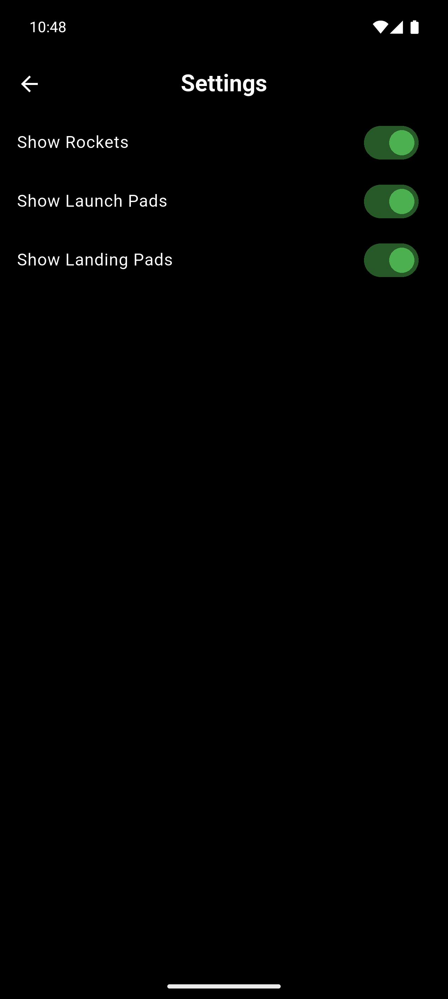
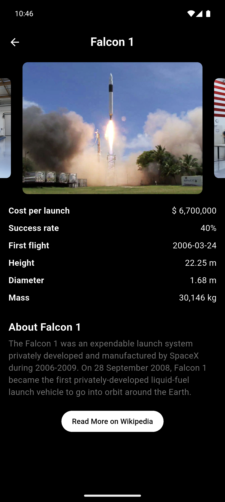
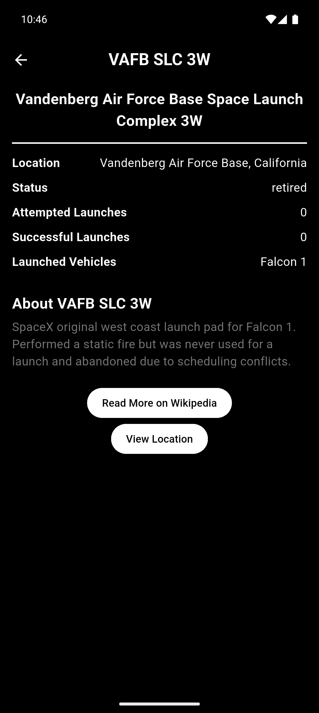

# 🚀 SpaceX Explorer

A beautiful Flutter app that explores SpaceX rockets, launch pads, and landing pads — with live refresh, offline awareness, and a sleek UI.

## Screenshots

<p align="center">
  
  
  
</p>

---

## 📱 Features

- 🔥 View latest **Rockets**, **Launch Pads**, and **Landing Pads**
- 🔄 Pull-to-refresh with a **custom rocket animation**
- 📡 Smart offline detection using `connectivity_plus`
- 📦 State management with `Provider`
- 💥 Custom UI components and icons
- 📴 Graceful handling when no internet is available

---

## 🧠 Tech Stack

- **Flutter** 💙
- `provider` for state management
- `connectivity_plus` for network status
- `custom_refresh_indicator` for animated pull-to-refresh
- `vibration` for subtle haptic feedback
- `flutter_svg` for scalable vector assets

---

## 🖼️ Screenshots

| Rockets View | Launch Pads |
|--------------|-------------|
|  |  |

---

## 🛠️ Setup Instructions

### 1. Clone the repo

```bash
git clone https://github.com/rZoysa/spacex_explorer.git
cd spacex_explorer
